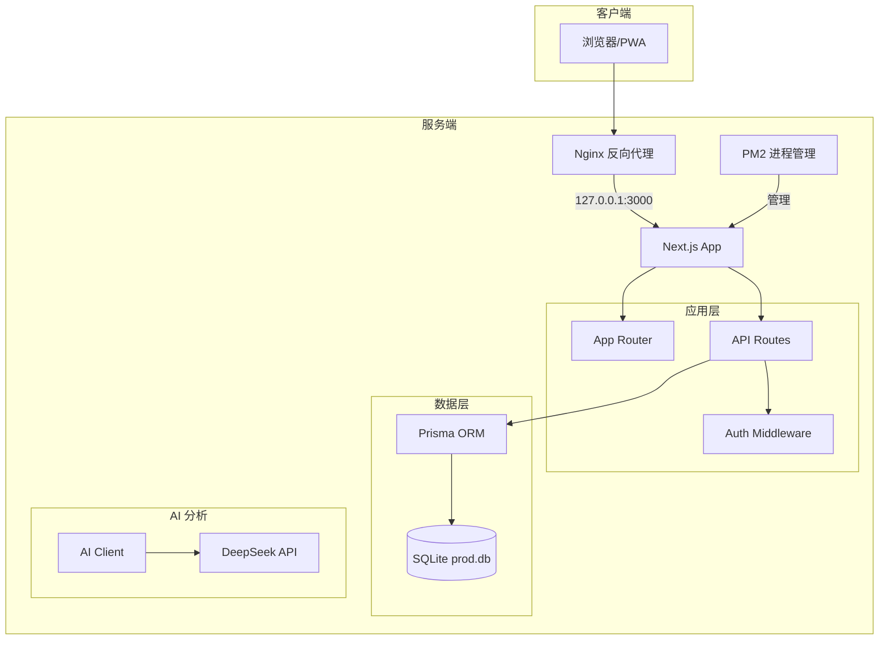
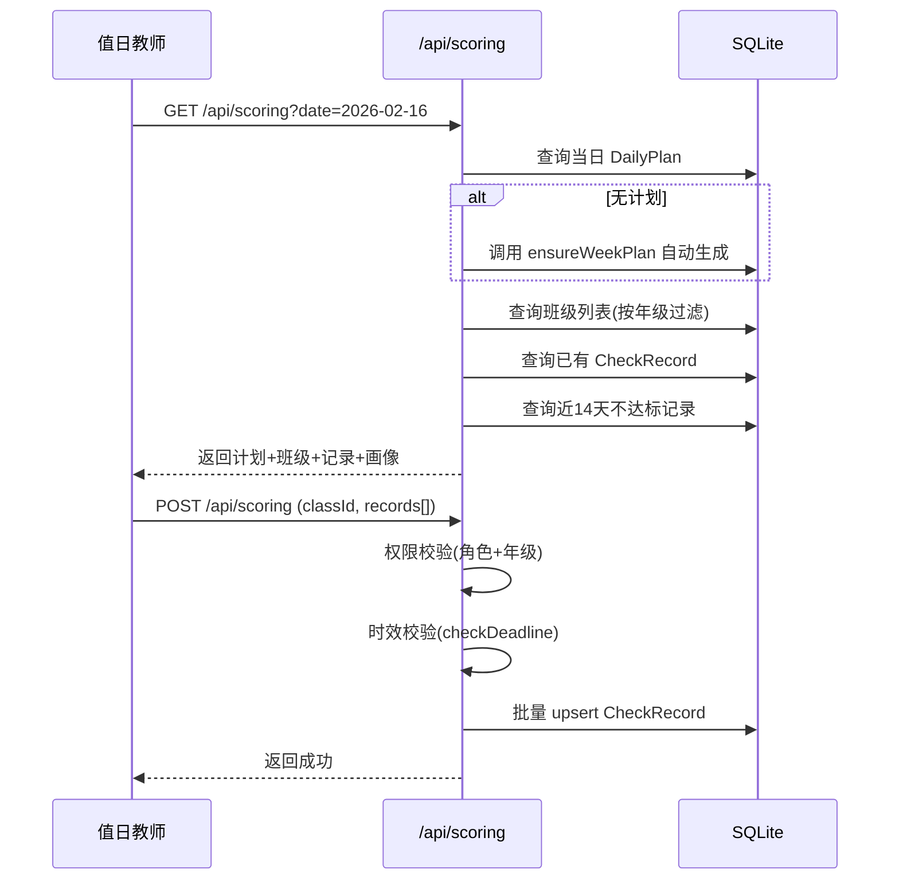

# 班级常规管理评分系统 - 开发运维技术手册

> **版本**：v1.0  
> **项目名称**：班级常规管理评分系统  
> **技术栈**：Next.js 16 + Prisma + SQLite + NextAuth + next-intl

---

## 目录

- [第一章 项目概览](#第一章-项目概览)
- [第二章 架构设计](#第二章-架构设计)
- [第三章 部署运维](#第三章-部署运维)
- [第四章 业务逻辑说明](#第四章-业务逻辑说明)
- [第五章 国际化](#第五章-国际化)
- [附录 环境变量清单](#附录-环境变量清单)

---

## 第一章 项目概览

### 1.1 项目简介

本系统是一套面向小学的班级常规管理评分平台，覆盖日常检查、周评、成绩报表、检查计划排期、AI 辅助分析等功能。支持中英双语、深色/浅色主题、移动端适配和 PWA。

### 1.2 技术栈

| 层级 | 技术选型 | 版本 |
|------|---------|------|
| **框架** | Next.js（App Router） | 16.1.6 |
| **前端** | React + TypeScript | React 19.2, TS 5 |
| **UI 组件** | HeroUI (NextUI) + Lucide Icons | HeroUI 2.8 |
| **样式** | Tailwind CSS 4 + tw-animate-css | - |
| **动画** | Framer Motion | 12.x |
| **图表** | ECharts + Recharts | ECharts 6, Recharts 3.7 |
| **ORM** | Prisma | 5.22 |
| **数据库** | SQLite | - |
| **认证** | NextAuth.js（Credentials Provider, JWT 策略） | 4.24 |
| **国际化** | next-intl | 4.8 |
| **主题** | next-themes | 0.4 |
| **AI** | OpenAI SDK（对接 DeepSeek API） | 6.21 |
| **测试** | Playwright | 1.58 |

### 1.3 目录结构

```
/
├── docs/                         # 项目文档
├── messages/                     # 国际化翻译文件
│   ├── zh.json                   #   中文
│   └── en.json                   #   英文
├── prisma/
│   ├── schema.prisma             # 数据库模型定义
│   ├── migrations/               # 迁移文件
│   ├── seed.ts                   # 种子数据（90天模拟数据）
│   └── prod.db                   # 生产数据库文件（不入库）
├── public/
│   ├── icons/                    # PWA 图标
│   └── manifest.json             # PWA 配置
├── scripts/
│   ├── backup-db.sh              # 数据库备份脚本
│   └── upgrade-check-items.ts    # 检查项升级脚本
├── src/
│   ├── app/
│   │   ├── (auth)/login/         # 登录页
│   │   ├── (dashboard)/          # 仪表盘布局组
│   │   │   ├── page.tsx          #   首页仪表盘
│   │   │   ├── daily-plan/       #   检查计划管理
│   │   │   ├── inspection/       #   检查项管理
│   │   │   ├── scoring/          #   日常评分
│   │   │   ├── weekly-review/    #   周评
│   │   │   ├── duty-history/     #   值日历史
│   │   │   ├── scores/           #   成绩报表
│   │   │   ├── classes/          #   班级管理
│   │   │   ├── users/            #   用户管理
│   │   │   ├── ai-panel/         #   AI 控制面板
│   │   │   ├── server-monitor/   #   服务器监控
│   │   │   └── layout.tsx        #   仪表盘布局
│   │   ├── api/                  # API 路由
│   │   │   ├── auth/             #   认证
│   │   │   ├── scoring/          #   评分
│   │   │   ├── weekly-review/    #   周评
│   │   │   ├── daily-plan/       #   检查计划
│   │   │   ├── inspection/       #   检查项
│   │   │   ├── scores/           #   成绩数据
│   │   │   ├── classes/          #   班级
│   │   │   ├── users/            #   用户
│   │   │   ├── ai/               #   AI 分析
│   │   │   ├── logs/             #   日志
│   │   │   ├── health/           #   健康检查
│   │   │   └── server-monitor/   #   服务器监控
│   │   ├── globals.css           # 全局样式
│   │   ├── layout.tsx            # 根布局
│   │   ├── error.tsx             # 错误页
│   │   └── global-error.tsx      # 全局错误页
│   ├── components/
│   │   ├── sidebar-nav.tsx       # 侧边栏导航
│   │   ├── providers.tsx         # 全局 Provider 组合
│   │   ├── locale-provider.tsx   # 国际化 Provider
│   │   ├── locale-toggle.tsx     # 语言切换
│   │   └── theme-toggle.tsx      # 主题切换
│   ├── lib/
│   │   ├── auth.ts               # NextAuth 配置
│   │   ├── ai-client.ts          # DeepSeek AI 客户端
│   │   ├── deadline.ts           # 评分时效控制
│   │   ├── env.ts                # 环境变量校验
│   │   ├── logger.ts             # 系统日志
│   │   ├── schedule-generator.ts # 排期生成算法
│   │   ├── school-calendar.ts    # 校历数据
│   │   ├── echarts-theme.ts      # 图表主题
│   │   └── server-i18n.ts        # 服务端国际化
│   ├── types/
│   │   └── next-auth.d.ts        # NextAuth 类型扩展
│   └── instrumentation.ts        # 启动时环境变量校验
├── deploy.sh                     # 自动部署脚本
├── package.json
├── tsconfig.json
└── prisma.config.ts
```

---

## 第二章 架构设计

### 2.1 系统架构



### 2.2 数据库模型关系

```mermaid
erDiagram
    User ||--o{ CheckRecord : "scoredBy"
    User ||--o{ CheckItem : "creator"
    User ||--o{ DailyPlan : "createdBy"
    User }o--o| Class : "classTeacher"

    Class ||--o{ CheckRecord : "has"

    CheckItem ||--o{ CheckRecord : "has"
    CheckItem ||--o{ DailyPlanItem : "includedIn"

    DailyPlan ||--o{ DailyPlanItem : "contains"

    User {
        string id PK
        string name
        string username UK
        string password
        string role
        string classId FK
        int managedGrade
    }

    Class {
        string id PK
        string name
        int grade
        int section
    }

    CheckItem {
        string id PK
        string code UK
        string module
        string title
        string description
        int sortOrder
        boolean isActive
        boolean isDynamic
        string planCategory
        string date
        int targetGrade
        string createdBy FK
    }

    DailyPlan {
        string id PK
        string date
        int targetGrade
        string createdById FK
    }

    DailyPlanItem {
        string id PK
        int sortOrder
        string planId FK
        string checkItemId FK
    }

    CheckRecord {
        string id PK
        string date
        boolean passed
        string severity
        string optionValue
        string comment
        string classId FK
        string checkItemId FK
        string scoredById FK
    }

    Semester {
        string id PK
        string name
        string startDate
        string endDate
        boolean isCurrent
    }

    AiAnalysis {
        string id PK
        string date
        string scope
        string content
        string model
        int tokens
    }

    AiModuleConfig {
        string scope PK
        string label
        string description
        string systemPrompt
        float temperature
        int maxTokens
        string model
        boolean isActive
    }
```

### 2.3 API 路由清单

#### 认证

| 方法 | 路径 | 说明 |
|------|------|------|
| POST | `/api/auth/[...nextauth]` | NextAuth 认证端点（登录/登出/会话） |

#### 评分

| 方法 | 路径 | 说明 | 权限 |
|------|------|------|------|
| GET | `/api/scoring` | 获取当日评分数据（计划、班级、已有记录、检查画像） | ADMIN, GRADE_LEADER, DUTY_TEACHER |
| POST | `/api/scoring` | 提交评分记录（批量 upsert） | ADMIN, GRADE_LEADER, DUTY_TEACHER |

#### 周评

| 方法 | 路径 | 说明 | 权限 |
|------|------|------|------|
| GET | `/api/weekly-review` | 获取周评数据和班级列表 | ADMIN, GRADE_LEADER |
| POST | `/api/weekly-review` | 提交周评记录 | ADMIN, GRADE_LEADER |
| GET | `/api/weekly-review/suggest` | 获取 W-5 等级 AI 建议 | ADMIN, GRADE_LEADER |

#### 检查计划

| 方法 | 路径 | 说明 | 权限 |
|------|------|------|------|
| GET | `/api/daily-plan` | 获取指定日期计划 | ADMIN |
| POST | `/api/daily-plan` | 创建/更新计划 | ADMIN |
| DELETE | `/api/daily-plan` | 删除计划 | ADMIN |
| GET | `/api/daily-plan/schedule-overview` | 学期排期总览 | ADMIN |
| POST | `/api/daily-plan/generate-schedule` | 生成学期排期 | ADMIN |
| GET | `/api/daily-plan/week` | 获取周计划 | ADMIN |
| GET | `/api/daily-plan/week-recommend` | 获取周推荐 | ADMIN |
| POST | `/api/daily-plan/confirm-week` | 确认周计划 | ADMIN |
| GET | `/api/daily-plan/suggest` | AI 单日推荐 | ADMIN |

#### 检查项管理

| 方法 | 路径 | 说明 | 权限 |
|------|------|------|------|
| GET | `/api/inspection` | 获取检查项列表 | ADMIN, GRADE_LEADER |
| POST | `/api/inspection` | 创建动态检查项 | ADMIN, GRADE_LEADER |
| PUT | `/api/inspection/[id]` | 更新检查项 | ADMIN, GRADE_LEADER |
| DELETE | `/api/inspection/[id]` | 删除检查项（软删除/物理删除） | ADMIN, GRADE_LEADER |

#### 成绩数据

| 方法 | 路径 | 说明 | 权限 |
|------|------|------|------|
| GET | `/api/scores` | 成绩报表（支持 period/scope 参数） | ALL |
| GET | `/api/scores/dashboard` | 仪表盘数据（按角色分流） | ALL |
| GET | `/api/scores/detail` | 班级详细成绩 | ALL |
| GET | `/api/scores/duty-history` | 值日教师历史 | DUTY_TEACHER |

#### 管理

| 方法 | 路径 | 说明 | 权限 |
|------|------|------|------|
| GET/POST | `/api/classes` | 班级列表/创建 | ADMIN, GRADE_LEADER |
| PUT/DELETE | `/api/classes/[id]` | 编辑/删除班级 | ADMIN, GRADE_LEADER |
| GET/POST | `/api/users` | 用户列表/创建 | ADMIN, GRADE_LEADER |
| PUT/DELETE | `/api/users/[id]` | 编辑/删除用户 | ADMIN, GRADE_LEADER |
| GET | `/api/logs` | 系统日志查询 | ADMIN |

#### AI 分析

| 方法 | 路径 | 说明 | 权限 |
|------|------|------|------|
| POST | `/api/ai/daily-analysis` | 触发每日 AI 分析 | 需 AI_CRON_SECRET |
| GET | `/api/ai/admin` | AI 面板数据 | ADMIN |
| GET/PUT | `/api/ai/config` | AI 模组配置管理 | ADMIN |

#### 运维

| 方法 | 路径 | 说明 | 权限 |
|------|------|------|------|
| GET | `/api/health` | 健康检查 | 公开 |
| GET | `/api/server-monitor` | 服务器状态 | ADMIN |
| POST | `/api/server-monitor/backup` | 手动触发备份 | ADMIN |

### 2.4 权限控制机制

系统使用 NextAuth.js 的 JWT 策略进行认证，token 中携带用户角色和关联信息：

```typescript
// JWT Token 结构
{
  id: string;          // 用户 ID
  role: string;        // ADMIN | GRADE_LEADER | DUTY_TEACHER | CLASS_TEACHER
  username: string;
  classId: string | null;      // 班主任关联的班级
  className: string | null;
  managedGrade: number | null; // 年级负责人/值日教师管理的年级
}
```

**权限分层**：

| 角色 | 数据范围 | 可访问功能 |
|------|---------|-----------|
| ADMIN | 全校 | 所有功能 |
| GRADE_LEADER | 本年级（`managedGrade` 过滤） | 仪表盘、检查项、评分、周评、成绩、班级、用户 |
| DUTY_TEACHER | 本年级（`managedGrade` 过滤） | 仪表盘、评分、值日历史 |
| CLASS_TEACHER | 本班级（`classId` 过滤） | 仪表盘、成绩 |

**权限校验要点**：

- API 层通过 `getServerSession(authOptions)` 获取当前用户信息
- GRADE_LEADER/DUTY_TEACHER 操作时，系统自动用 `managedGrade` 过滤数据
- 班主任仅能查看 `classId` 匹配的班级数据
- JWT 回调中校验用户是否仍存在于数据库，防止数据库重置后 token 残留

### 2.5 日志系统

日志写入项目根目录 `system.log` 文件，JSON Lines 格式，每行一条：

```json
{
  "timestamp": "2026-02-16T08:30:00.000Z",
  "level": "INFO",
  "category": "DATA",
  "action": "UPSERT",
  "user": "zhanglaoshi",
  "role": "DUTY_TEACHER",
  "model": "CheckRecord",
  "data": { "classId": "xxx", "passed": true },
  "ip": "192.168.1.1"
}
```

**日志分类**：

| 类别 | 说明 | 触发场景 |
|------|------|---------|
| AUTH | 认证事件 | 登录成功/失败、登出 |
| DATA | 数据变更 | 创建/更新/删除操作 |
| SYSTEM | 系统错误 | API 异常 |
| DB | 数据库操作 | Prisma 层面的变更（兜底） |

敏感字段（password 等）在写入前自动替换为 `[FILTERED]`。

---

## 第三章 部署运维

### 3.1 服务器信息

| 项目 | 说明 |
|------|------|
| **服务器** | 阿里云 ECS（Alibaba Cloud Linux 3） |
| **IP** | 8.145.51.48 |
| **管理面板** | 宝塔 Linux 面板 9.2.0（端口 8888） |
| **项目路径** | `/www/wwwroot/scoring-system/` |
| **进程管理** | PM2（进程名 `scoring-system`） |
| **反向代理** | Nginx → 127.0.0.1:3000 |
| **数据库** | SQLite，生产文件 `prisma/prod.db` |

### 3.2 部署流程

使用项目根目录的 `deploy.sh` 脚本一键部署：

```bash
# 在本地项目根目录执行
expect deploy.sh
```

**部署流程**：

1. 打包本地代码（排除 node_modules、.env、*.db）
2. 上传到服务器 `/www/wwwroot/scoring-system/`
3. 在服务器执行 `npm install`
4. 执行 `prisma migrate deploy`（数据库迁移）
5. 执行 `next build`（构建前端）
6. 通过 PM2 重启进程

**注意事项**：

- `.env` 文件不会被同步（本地为开发配置，服务器为生产配置）
- 数据库文件 `*.db` 不会被同步（保护生产数据）
- 前端变更部署后需等待约 30 秒构建完成
- 构建命令 `npm run build` 会自动执行 `prisma generate` 和 `prisma migrate deploy`

### 3.3 数据库管理

#### 数据库文件

- **开发环境**：`prisma/dev.db`（本地开发，由 `DATABASE_URL` 配置）
- **生产环境**：`prisma/prod.db`（服务器，路径 `/www/wwwroot/scoring-system/prisma/prod.db`）

#### 数据库迁移

```bash
# 开发环境：创建新迁移
npx prisma migrate dev --name <迁移名称>

# 生产环境：应用迁移（在 build 命令中自动执行）
npx prisma migrate deploy
```

#### 种子数据

```bash
# 播种 90 天模拟数据（开发环境调试）
npm run db:seed

# 重置数据库并重新迁移
npm run db:reset
```

#### 定时备份

生产环境通过 `scripts/backup-db.sh` 实现自动备份：

- **触发方式**：宝塔面板计划任务或 crontab
- **调度**：每天凌晨 3:00
- **保留策略**：保留最近 30 个备份
- **备份路径**：`/www/wwwroot/scoring-system/prisma/backups/`
- **日志**：`/www/wwwroot/scoring-system/scripts/backup.log`

Crontab 配置：

```
0 3 * * * /bin/bash /www/wwwroot/scoring-system/scripts/backup-db.sh
```

### 3.4 进程管理

```bash
# 查看进程状态
pm2 status

# 重启应用
pm2 restart scoring-system

# 查看日志
pm2 logs scoring-system

# 查看监控
pm2 monit
```

### 3.5 健康检查

系统提供 `/api/health` 端点用于健康监测：

```bash
curl http://8.145.51.48/api/health
```

### 3.6 启动时环境校验

应用启动时通过 Next.js Instrumentation Hook（`src/instrumentation.ts`）自动校验环境变量。缺少必要变量（`DATABASE_URL`, `NEXTAUTH_SECRET`, `NEXTAUTH_URL`）时直接抛出错误，阻止启动。

---

## 第四章 业务逻辑说明

### 4.1 评分流程



**关键规则**：

- 日评仅限当天录入（`isDailyScoringOpen` 基于中国时区 Asia/Shanghai 判定）
- 管理员可超期操作，系统标记 `isOverride`
- 每条记录通过 `@@unique([classId, checkItemId, date])` 确保唯一性
- 不达标时 `severity` 可选：`minor` / `moderate` / `serious`

### 4.2 检查计划生成算法

#### 学期排期（均衡覆盖底盘）

核心逻辑位于 `src/lib/schedule-generator.ts`：

1. **分类**：将 D-1 至 D-9 按 `planCategory` 分为常驻（resident）和轮转（rotating）
2. **分组**：轮转项按每组 1~2 项分组
3. **分配**：每组分配连续 2 周
4. **上限**：每周最多 5 项（常驻 + 轮转）

```
slotsPerWeek = 5 - resident.length
每组分配 = 连续 2 周
周次从第 1 周排到第 19 周，循环分配
```

**保底规则**：

- 常驻项上限 3 个，超出按 sortOrder 后→前移入轮转
- 常驻项下限 2 个（从轮转中补充）
- 轮转项下限 3 个

#### 周推荐算法

推荐优先级排序：

1. **强制覆盖**：超过最大间隔周数（`maxGap`）的项目强制纳入
2. **不达标率高优先**：近 14 天不达标率高的优先
3. **距上次检查久优先**：最久未检查的优先

```
maxGap = max(4, ceil(rotating.length / slotsPerWeek) * 2)
```

#### 自动兜底（ensureWeekPlan）

当评分页面发现当天无 DailyPlan 时自动触发：

- 检查该周是否完全没有任何 DailyPlan
- 如果完全没有，使用学期基线自动生成该周所有教学日的计划
- 已有计划的周不会触发

#### 调整建议算法

两条简单规则：

| 规则 | 条件 | 建议 |
|------|------|------|
| 提升为常驻 | 轮转项近 30 天不达标率 > 25%，且常驻项 < 3 | promote |
| 降为轮转 | 常驻项近 30 天不达标率 < 5% | demote |

### 4.3 周评等级判定算法

W-5 综合等级的自动建议逻辑（固定规则 v3.0）：

```
输入：本周日评记录 + W-1~W-4 填写结果

Step 1: 计算日评达标率 = passed / total
Step 2: 统计严重程度分布（minor / moderate / serious）
Step 3: 判定等级

C（预警）触发条件（优先判定）：
  - 达标率 < 70%  OR
  - 存在 serious 不达标  OR
  - W-2~W-4 任一 >= 2 起  OR
  - W-1 >= 2 人次

A（卓越）条件：
  - 达标率 >= 90%  AND
  - 无 serious 和 moderate 不达标  AND
  - W-1~W-4 均为 0

B（良好）：
  - 不满足 A 也不满足 C
  - 达标率 70%~89%
  - W-1~W-4 单项 <= 1 起
```

**数据充分性**：

| 条件 | 置信度 |
|------|--------|
| 日评记录 >= 10 条 | high |
| 日评记录 5~9 条 | medium |
| 日评记录 < 5 条 | low |
| 周评未填满 4 项 | 置信度降一级 |

### 4.4 时效控制

所有时效判断基于中国标准时间（Asia/Shanghai, UTC+8），核心逻辑在 `src/lib/deadline.ts`：

| 评分类型 | 开放时间 | 截止时间 | 管理员 |
|---------|---------|---------|--------|
| 日评 | 当天 00:00 | 当天 23:59 | 可超期，标记 isOverride |
| 周评 | 本周五 | 下周一 12:00 | 可超期，标记 isOverride |

**时区注意**：不可使用 `new Date().toISOString().split("T")[0]` 获取日期，该方法返回 UTC 日期，在北京时间 00:00~08:00 之间会比中国日期早一天。应使用 `getChinaToday()` 函数。

### 4.5 校历模块

校历数据定义在 `src/lib/school-calendar.ts`，结构化存储学期周次信息：

- **学期**：2025-2026 学年第二学期（2026-03-02 至 2026-07-10）
- **周次**：共 19 周
- **节假日**：清明节、劳动节、端午节（含短周标记）
- **工具函数**：`getWeekByDate`、`getCurrentWeek`、`isSchoolDay` 等

换学期时只需更新 `CURRENT_CALENDAR` 对象。

### 4.6 AI 分析模块

#### 架构

- **客户端**：`src/lib/ai-client.ts`，使用 OpenAI SDK 对接 DeepSeek API（`https://api.deepseek.com`）
- **分析触发**：通过 `/api/ai/daily-analysis` 端点触发（需 `AI_CRON_SECRET` 验证）
- **结果存储**：`AiAnalysis` 表，按 `date + scope` 唯一存储

#### 分析维度

| scope | 说明 | 消费方 |
|-------|------|--------|
| global | 全校综合分析 | ADMIN 仪表盘 |
| grade-1/2/3 | 年级分析 | GRADE_LEADER 仪表盘 |
| duty | 值日教师建议 | DUTY_TEACHER 仪表盘 |
| daily-recommend | 每日检查项推荐 | 检查计划管理 |

#### 模组配置

每个分析维度可独立配置（`AiModuleConfig` 表）：

| 参数 | 默认值 | 说明 |
|------|--------|------|
| systemPrompt | 空（使用代码默认） | 自定义 System Prompt |
| temperature | 0.3 | 生成温度 |
| maxTokens | 2000 | 最大 Token 数 |
| model | deepseek-chat | 模型名称 |
| isActive | true | 是否启用 |

### 4.7 检查画像（Inspector Profile）

评分 API 在返回数据时计算值日教师的个人画像：

| 指标 | 计算方式 |
|------|---------|
| 个人达标率 | 个人评分的 passed=true 比例 |
| 全校/年级平均达标率 | 全部记录的 passed=true 比例（用于对比） |
| 严重程度分布 | minor/moderate/serious 各自的百分比 |
| 评价深度（评论率） | 有 comment 的记录占比 |
| 工作天数 | 有评分记录的不同日期数 |
| 指导等级 | 基于达标率偏差：lenient_high / lenient_mild / balanced / strict_mild / strict_high |

---

## 第五章 国际化

### 5.1 翻译文件结构

翻译文件位于 `messages/` 目录：

```
messages/
├── zh.json    # 中文翻译
└── en.json    # 英文翻译
```

两个文件的 key 结构必须完全镜像，不允许一方有而另一方缺失的 key。

### 5.2 命名空间

| 命名空间 | 用途 |
|---------|------|
| `nav` | 侧边栏导航、角色名称 |
| `common` | 通用 UI（按钮、状态、年级名称等） |
| `error` | 错误页面 |
| `auth` | 登录页 |
| `dashboard` | 仪表盘 |
| `scores` | 成绩报表 |
| `scoring` | 日常评分 |
| `inspection` | 检查管理 |
| `classes` | 班级管理 |
| `users` | 用户管理 |
| `logs` | 系统日志 |
| `dutyHistory` | 值日历史 |
| `dailyPlan` | 每日检查计划 |
| `weeklyReview` | 周报 |
| `aiPanel` | AI 控制面板 |

### 5.3 使用方式

**客户端组件**：

```typescript
import { useTranslations } from "next-intl";

export function MyComponent() {
  const t = useTranslations("dashboard");
  return <h1>{t("title")}</h1>;
}
```

**变量占位符**：

```json
// zh.json
{ "welcome": "{name}，欢迎回来" }

// en.json
{ "welcome": "Welcome back, {name}" }
```

### 5.4 新增翻译规范

1. 页面组件中禁止硬编码文本（中文/英文），所有面向用户的文本必须通过 `t("key")` 引用
2. 每次新增/修改翻译 key，必须同时更新 `zh.json` 和 `en.json`
3. 新增 key 应放入对应的命名空间
4. 变量占位符 `{variable}` 在两个文件中必须完全一致

---

## 附录 环境变量清单

### 必需变量

| 变量名 | 说明 | 示例值 |
|--------|------|--------|
| `DATABASE_URL` | SQLite 数据库路径 | `file:./prod.db` |
| `NEXTAUTH_SECRET` | NextAuth 加密密钥 | 随机字符串 |
| `NEXTAUTH_URL` | 应用 URL | `http://8.145.51.48` |

### 可选变量

| 变量名 | 说明 | 默认行为 |
|--------|------|---------|
| `DEEPSEEK_API_KEY` | DeepSeek API 密钥 | AI 分析功能不可用 |
| `AI_CRON_SECRET` | AI 定时分析验证密钥 | AI 定时任务不可用 |

**注意**：`.env` 文件不纳入版本控制，本地开发环境和生产环境使用不同的配置。

---

> **本文档供开发和运维人员参考，如需更新请同步修改并告知相关人员。**
